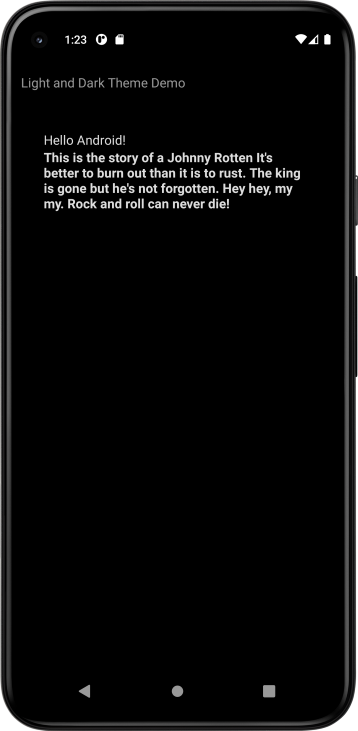
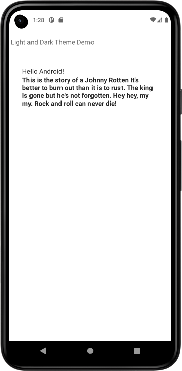

# Light and Dark Theme Demo
Simple app to show how Light and Dark Themes are set.


- From Project View, In the res folder, add a new "Android Resources Directory" called "values-night".
- Within values-night folder, add a "Values Resource File" called "themes.xml".
- Add a style tag with the name as Theme.Xxxx and the parent as android:style/Theme.Material.NoActionBar.
- add the item android:statusBarColor and inside the item give it a color @color_brlue_sky

## Notes
- The status bar 
  - it the very top line on the app.. where the time, wifi icon and other icons are displayed
  - In Light Color status bar you might need this line to make icons visible
    - ```<item name="android:windowLightStatusBar">true</item>```
  - The color is set in approppriate Dark or Light Theme.xml in `statusBarColor`
```kotlin
    <item name="android:statusBarColor">@color/Purple_700</item>
```
- The Top App bar
  - is set by code with TopAppBar() in scaffold
    - The color can be controled with:
```kotlin
TopAppBar(
    // ...
    backgroundColor = Color.Transparent,
    // ...
)
```
```kotlin
TopAppBar(
    // ...
    backgroundColor = MaterialTheme.colors.background,
    // ...
)
```
<p style=float:left">
  
  
</p>

     
ref: demo-light-and-dark-theme-app-android-kotlin-compose